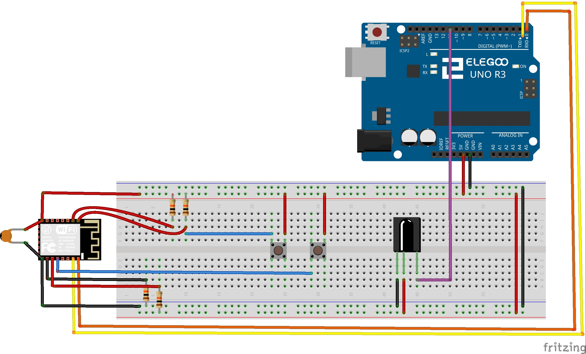
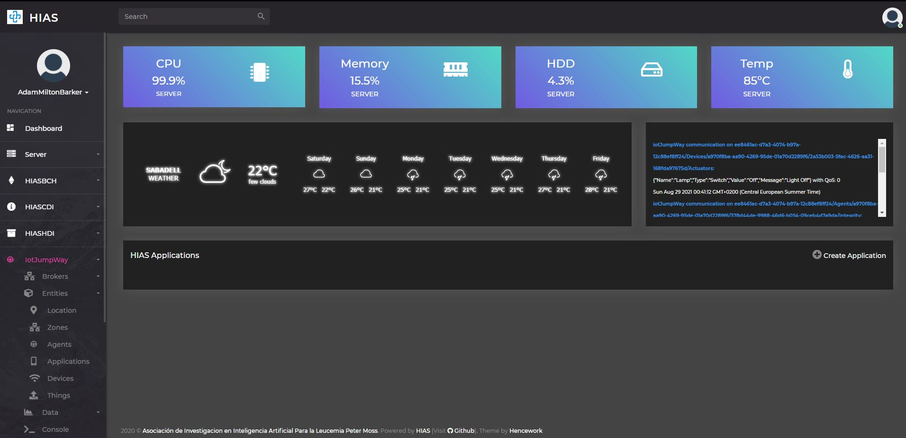
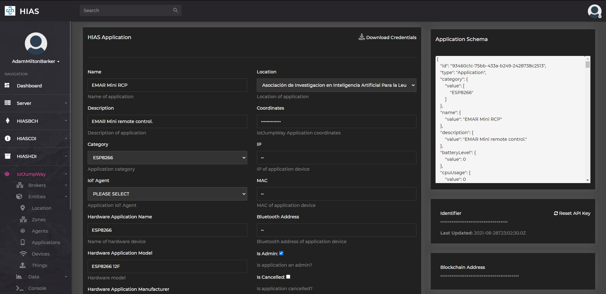

# Remote Control Installation Guide


# Introduction
The following guide will take you through setting up and installing the [EMAR Mini Emergency Assistance Robot](https://www.github.com/AIIAL/EMAR-Mini "EMAR Mini Emergency Assistance Robot") remote control.

The Raspberry Pi 4 homes the EMAR Mini software and powers the Intel hardware.

&nbsp;

# DISCLAIMER

You should always be very careful when working with electronics! Please use this tutorial at your own risk. Make sure to take measures to ensure your own safety.

&nbsp;

# V1 Required Hardware

- 1 x ELEGOO UNO R3 Remote Control
- 1 x ELEGOO IR Receiver Module
- 1 x Breadboard
- 1 x ESP8266
- 1 x USB to serial TTL UART Module
- 2 x Push Buttons
- 1 x 100Uf Ceramic Capacitor
- 5 x 10k Resistors
- 1 x Soldering Iron
- Solder wire
- Jumper wires

&nbsp;

# ESP8266 12F


First you will start with the ESP8266 12F. To start, heat up your soldering iron. Next you need to solder wires to the following pins:

- TXD0
- RXD0
- GPIO0
- GPIO2
- GPIO15
- GND
- VCC
- RST
- EN

In addition you need to solder the capacitor bridging betyouen GND & VCC.

&nbsp;

# ELEGOO UNO R3 & Breadboard


You are now ready to move on to setting up your ELEGOO UNO R3 and breadboard. Follow the breadboard diagram above to set up your circuit.

Notice you are powering the ESP8266 directly from the 5V out of the ELEGOO UNO. As you are using the ESP8266, battery operation will not be possible as it will drain very quickly. You will need to plug your ELEGOO UNO into the mains using a suitable power adapter.

**WARNING: Many will advise not to power ESP8266 with 5V, however in my experience it is the only way that ESP8266 will work correctly with SSL. It is advised that the ESP8266 is not designed to run at 5V, however running at 3V you will more than likely not be able to make this project work. In all the years I have been using ESP8266, I have never had an issue with a single chip powering it with 5V. You should use 5V at your own discression**


The ESP8266 is used for WiFi communication, it connects to the HIAS iotJumpWay MQTT broker and waits for activity from the IR sensor, when it receives commands it sends via the iotJumpWay to EMAR Mini which allows you to control the robot using the remote control.

&nbsp;

# HIAS iotJumpWay Credentials

Now you are going to set up the HIAS iotJumpWay Application. iotJumpway applications have the permissions to listen to and publish to all topics on the network where as devices can only connect to topics related to themselves. In this way the application credentials will be used to connect the ESP8266 to the HIAS iotJumpWay MQTT Broker and publish commands to EMAR.



 Head over to the HIAS UI and navigate to  **iotJumpWay->Applications** and click the `Create Application` to the right of the screen. Fill out the required information and click **Submit**.



 You will be provided with the credentials for your application, you can alse retrieve all credentials with exception to the network secret API key by clicking on the `Download Credentials` button. You can reset your network API secret key using the `Reset API Key` button.

&nbsp;

# EMAR-RCP


EMAR-RCP is the publisher that sends the commands to EMAR Mini via the iotJumpWay.

To begin with you need to flash the [EMAR-RCP](https://github.com/AIIAL/EMAR-Mini/blob/main/remote-control/emar-rcp/emar-rcp.ino "EMAR-RCP") software to the ESP8266. You will need to make sure your Arduino enviornment is set up for [ESP8266 dev](https://arduino-esp8266.readthedocs.io/en/latest/installing.html) before you continue.

In the [EMAR-RCP](https://github.com/AIIAL/EMAR-Mini/blob/main/remote-control/emar-rcp/emar-rcp.ino "EMAR-RCP") file, you need to add your SSL certificate fingerprint, your WiFi details and iotJumpWay Application credentials.

To get your SSL certifcate fingerprint, you should click on the padlock in the browser window when you are on the HIAS UI


Then click **Certificate**. This will open up a window with details about your certificate.


Now click on **Details** and scroll down until you see **Thumbprint**. Click on Thumbprint and your certificate thumbprint will be displayed in the window. You should copy this thumbprint and paste it into the **fingerprint[]** setting at the top of the file (See below).

Now add your SSID and WiFi password to the settings, the URL of your HIAS server, and the iotJumpWay Application details. For the Zone and Device IDs you should use the Zone and Entity ID of EMAR Mini.

``` cpp
const char fingerprint[] PROGMEM = "";

const char* ssid = "";
const char* password = "";

const char* mqtt_server = "";
int mqttPort = 8883;

String locationID = "";
String applicationID = "";
char applicationName[] = "";
char mqttUsername[] = "";
char mqttPassword[] = "";
char willTopic[50];

String zoneID = "";
String deviceID = "";
```

Using your chosen USB to serial TTL UART Module and the breadboard, connect RX of the serial module to the TX of the ESP8266, next connect the TX of your serial module to the RX of ESP8266 and connect the power and ground cables (Make sure you move the UNO -> ESP8266 serial connection first).

Assuming you have the Arduino IDE set up, you can now flash the ESP8266. You will notice there are two push buttons. The one closest to the ESP8266 is for setting the ESP8266 into flash mode, the second button is for resetting the device.

Press the upload button in Arduino IDE and straight away hold the flashing button down, after a couple of seconds push the reset button and then release both. You should see the blue LED start to flash, this means that the ESP8266 is being flashed.

Once it has finished, the ESP8266 is ready.

&nbsp;

# EMAR-RCR
[EMAR-RCR](https://github.com/AIIAL/EMAR-Mini/blob/main/remote-control/emar-rcr/emar-rcr.ino) is the remote control receiver, it waits for commands sent from the remote control and sends them via serial to the RCP script running on the ESP8266.


To begin with you need to flash the software to the ELEGOO UNO R3. Connect your UNO R3 to your computer.

Next you need to add the EMAR Mini Device ID to the settings at the top of the file.

```
String deviceID = "";
```

Flash the software to the ELEGOO UNO.

# Continue

Now you can continue back to the [usage guide](../usage/index.md "usage guide").

&nbsp;

# Contributing
Asociación de Investigacion en Inteligencia Artificial Para la Leucemia Peter Moss encourages and youlcomes code contributions, bug fixes and enhancements from the Github community.

Please read the [CONTRIBUTING](https://github.com/AIIAL/EMAR-Mini/blob/main/CONTRIBUTING.md "CONTRIBUTING") document for a full guide to contributing to our research project. You will also find our code of conduct in the [Code of Conduct](https://github.com/AIIAL/EMAR-Mini/blob/main/CODE-OF-CONDUCT.md) document.

## Contributors
- [Adam Milton-Barker](https://www.leukemiaairesearch.com/association/volunteers/adam-milton-barker "Adam Milton-Barker") - [Asociación de Investigacion en Inteligencia Artificial Para la Leucemia Peter Moss](https://www.leukemiaresearchassociation.ai "Asociación de Investigacion en Inteligencia Artificial Para la Leucemia Peter Moss") President/Founder & Lead Developer, Sabadell, Spain

&nbsp;

# Versioning
We use [SemVer](https://semver.org/) for versioning.

&nbsp;

# License
This project is licensed under the **MIT License** - see the [LICENSE](LICENSE "LICENSE") file for details.