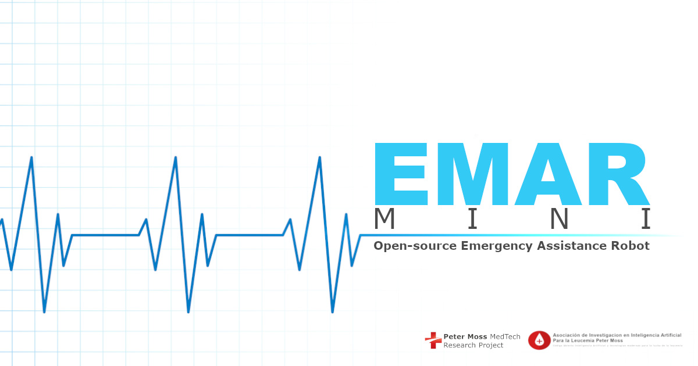
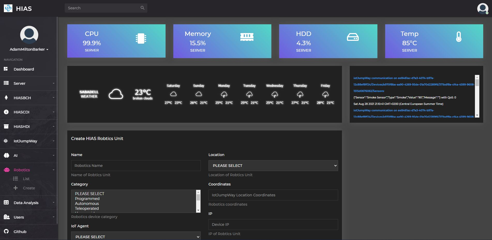
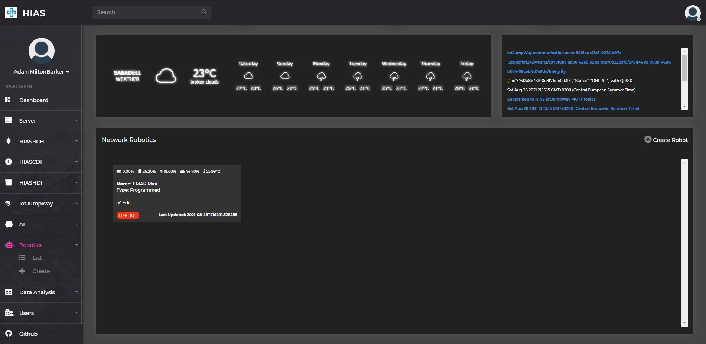
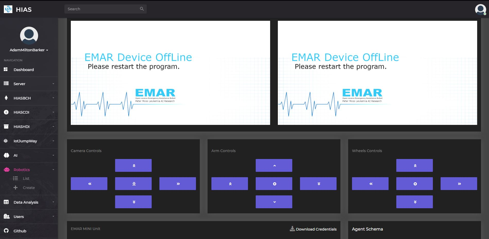

# Raspian Installation Guide



&nbsp;

# Introduction
This document will guide you through the installation process for the EMAR Mini - Emergency Assistance Robot software on your Raspberry Pi.

**MAKE SURE THAT YOUR REALSENSE CAMERA IS NOT PLUGGED IN UNTIL THE END OF THE INSTALLATION**s

&nbsp;

# Raspberry Pi OS Lite

In this tutorial we will use Raspberry Pi OS Lite (Buster). First of all download the image from the [Raspberry Pi OS download page](https://www.raspberrypi.org/downloads/raspberry-pi-os/ " Raspberry Pi OS download page"), extract the image file, and write it to an SDK card. In our project we have used a 64GB SD card.

Once you have done this, insert it in your Raspberry Pi 4, when you have logged in, use the following command to update your device and then open the Raspberry Pi configuration application. You need to expand your filesystem, setup your keyboard preferences and connect your RPI4 to your network.

```
sudo apt-get update && sudo apt-get upgrade
sudo raspi-config
```

&nbsp;

# Clone the repository

Clone the [EMAR Mini - Emergency Assistance Robot ](https://github.com/AIIAL/EMAR-Mini " EMAR Mini - Emergency Assistance Robot ") repository from the [Peter Moss MedTech Research Project](https://github.com/AIIAL "Peter Moss MedTech Research Project") Github Organization to your Raspberry Pi.

Now navigate to your home directory on your Raspberry using commandline, then use the following command:

```
 git clone https://github.com/AIIAL/EMAR-Mini.git
```

Once you have used the command above you will see a directory called **EMAR-Mini** in your home directory.

```
 ls
```

Using the ls command in your home directory should show you the following.

```
 EMAR-Mini
```

Navigate to the **EMAR-Mini** directory, this is your project root directory for this tutorial.

&nbsp;

# HIAS


First you will need to add your robot to your HIAS network. Head to the HIAS UI and navigate to `Robotics -> Create`. Fill in the details for your robot and submit.



You can access your HIAS robots by navigating to `Robitics -> List`, choose the robot you want you edit / control and click on the edit button for that robot.



You should now update your server coniguration with the reverse proxy that will forward authorized encrypted traffic to EMAR Mini.

You need to add the endpoint you used when adding your robot to the HIAS netwok and replace `YourEndpoint` in the code below with it.

Next replace `EmarIP` with the IP address of your Raspberry Pi and `EmarPort` with your port.

``` bash
location ~* ^/Robotics/Unit/EMAR-Mini/YourEndpoint/(.*)$ {
    auth_basic "Restricted";
    auth_basic_user_file /etc/nginx/security/htpasswd;
    proxy_pass http://EmarIP:EmarPort/$1;
}
```

Now open the server configuration:

``` bash
sudo nano /etc/nginx/sites-available/default
```

Navigate to the `HIAS Robotics` block and enter your modified code. Now you need to reload the server:

``` bash
sudo systemctl reload nginxs
```

Now download the credentials for your robot. Click on the `Download Credentials` button and save the file as `credentials.json` in the `ProjectRoot/configiuration` directory on your Raspberry Pi.

&nbsp;

# Installation
Now you are ready to install EMAR Mini on your Raspberry Pi. To do so use the following command from the project root.

 The installation is an interactive one so make sure to keep an eye on the console output. Follow the instructions provided by the installation script.

``` bashx
 sh scripts/install.sh
```

&nbsp;

# Continue
Now you can continue to the [usage guide](../usage/raspian.md) to test that everything has worked properly.

&nbsp;

# Contributing
Asociación de Investigacion en Inteligencia Artificial Para la Leucemia Peter Moss encourages and welcomes code contributions, bug fixes and enhancements from the Github community.

Please read the [CONTRIBUTING](https://github.com/AIIAL/EMAR-Mini/blob/main/CONTRIBUTING.md "CONTRIBUTING") document for a full guide to contributing to our research project. You will also find our code of conduct in the [Code of Conduct](https://github.com/AIIAL/EMAR-Mini/blob/main/CODE-OF-CONDUCT.md) document.

## Contributors
- [Adam Milton-Barker](https://www.leukemiaairesearch.com/association/volunteers/adam-milton-barker "Adam Milton-Barker") - [Asociación de Investigacion en Inteligencia Artificial Para la Leucemia Peter Moss](https://www.leukemiaresearchassociation.ai "Asociación de Investigacion en Inteligencia Artificial Para la Leucemia Peter Moss") President/Founder & Lead Developer, Sabadell, Spain

&nbsp;

# Versioning
We use [SemVer](https://semver.org/) for versioning.

&nbsp;

# License
This project is licensed under the **MIT License** - see the [LICENSE](LICENSE "LICENSE") file for details.