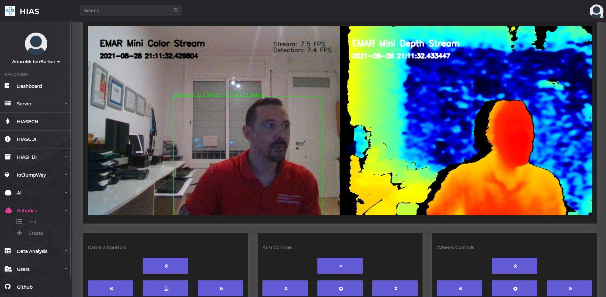

# Raspian Testing Guide


# Introduction
This document will guide you through the checking the EMAR Mini - Emergency Assistance Robot software on your Raspberry Pi.

&nbsp;

# Start EMAR Mini
With everything installed you are now ready to start EMAR Mini to test the installation so far. To do this navigate to the project root on your Raspberry Pi and issue the following command:

``` bash
python3 emar.py
```

If everything has been done correctly, EMAR Mini will now be streaming the color and depth frames from the Realsense D415.



Head over to the HIAS UI and naviate to your robot in the Robotics section. You should now see the stream from EMAR Mini.

To do a final test click the buttons and check that EMAR Mini is receiving the commands by checking the output from the device. You will see similar to the following:

``` bash
2021-08-28 21:25:47,536 - EMAR - INFO - b'{"From":"04dded41-73da-47db-81e6-08cd36ed628c","Type":"Arm","Value":"UP","Message":"Move UP"}'
2021-08-28 21:25:47,537 - EMAR - INFO - iotJumpWay Robotics ee8461ac-d7a3-4074-b97a-12c88ef8ff24/Robotics/0fed96eb-0fb9-4bd9-b8db-050e9b5e0794/Commands communication received.
2021-08-28 21:25:47,551 - EMAR - INFO - Recieved iotJumpWay Command Data : {"From":"04dded41-73da-47db-81e6-08cd36ed628c","Type":"Arm","Value":"UP","Message":"Move UP"}
2021-08-28 21:25:48,134 - EMAR - INFO - b'{"From":"04dded41-73da-47db-81e6-08cd36ed628c","Type":"Arm","Value":"2UP","Message":"Move 2UP"}'
2021-08-28 21:25:48,134 - EMAR - INFO - iotJumpWay Robotics ee8461ac-d7a3-4074-b97a-12c88ef8ff24/Robotics/0fed96eb-0fb9-4bd9-b8db-050e9b5e0794/Commands communication received.
2021-08-28 21:25:48,134 - EMAR - INFO - Recieved iotJumpWay Command Data : {"From":"04dded41-73da-47db-81e6-08cd36ed628c","Type":"Arm","Value":"2UP","Message":"Move 2UP"}
2021-08-28 21:25:48,636 - EMAR - INFO - b'{"From":"04dded41-73da-47db-81e6-08cd36ed628c","Type":"Arm","Value":"DOWN","Message":"Move DOWN"}'
2021-08-28 21:25:48,636 - EMAR - INFO - iotJumpWay Robotics ee8461ac-d7a3-4074-b97a-12c88ef8ff24/Robotics/0fed96eb-0fb9-4bd9-b8db-050e9b5e0794/Commands communication received.
2021-08-28 21:25:48,637 - EMAR - INFO - Recieved iotJumpWay Command Data : {"From":"04dded41-73da-47db-81e6-08cd36ed628c","Type":"Arm","Value":"DOWN","Message":"Move DOWN"}
2021-08-28 21:25:49,138 - EMAR - INFO - b'{"From":"04dded41-73da-47db-81e6-08cd36ed628c","Type":"Arm","Value":"2DOWN","Message":"Move 2DOWN"}'
2021-08-28 21:25:49,139 - EMAR - INFO - iotJumpWay Robotics ee8461ac-d7a3-4074-b97a-12c88ef8ff24/Robotics/0fed96eb-0fb9-4bd9-b8db-050e9b5e0794/Commands communication received.
2021-08-28 21:25:49,139 - EMAR - INFO - Recieved iotJumpWay Command Data : {"From":"04dded41-73da-47db-81e6-08cd36ed628c","Type":"Arm","Value":"2DOWN","Message":"Move 2DOWN"}
```

&nbsp;

# Continue
Now you can continue to the [STL guide](../../stls/index.md) to find out how to print the STLs and assemble EMAR.

&nbsp;

# Contributing
Asociación de Investigacion en Inteligencia Artificial Para la Leucemia Peter Moss encourages and welcomes code contributions, bug fixes and enhancements from the Github community.

Please read the [CONTRIBUTING](https://github.com/AIIAL/EMAR-Mini/blob/main/CONTRIBUTING.md "CONTRIBUTING") document for a full guide to contributing to our research project. You will also find our code of conduct in the [Code of Conduct](https://github.com/AIIAL/EMAR-Mini/blob/main/CODE-OF-CONDUCT.md) document.

## Contributors
- [Adam Milton-Barker](https://www.leukemiaairesearch.com/association/volunteers/adam-milton-barker "Adam Milton-Barker") - [Asociación de Investigacion en Inteligencia Artificial Para la Leucemia Peter Moss](https://www.leukemiaresearchassociation.ai "Asociación de Investigacion en Inteligencia Artificial Para la Leucemia Peter Moss") President/Founder & Lead Developer, Sabadell, Spain

&nbsp;

# Versioning
We use [SemVer](https://semver.org/) for versioning.

&nbsp;

# License
This project is licensed under the **MIT License** - see the [LICENSE](LICENSE "LICENSE") file for details.